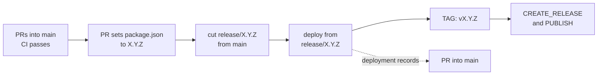

# Release Flow

This flow covers every 1inch contract repository: solidity-utils, aqua, swap-vm, limit-order-protocol, fusion-protocol and cross-chain-swap. A repository that deploys nothing, such as solidity-utils, skips the deploy and the deployment records; every other step is the same.

Contracts are immutable and every version is a fresh deploy, so: **one release branch == one audit == one deploy == one tag.**

## Branches

**`main`** — development. All work lands via pull requests, and CI tests each of them before the merge.

**`release/X.Y.Z`** — one per version, cut from a commit on `main` whose `package.json` already says `X.Y.Z`. The branch never changes after the cut: no pushes, no pull requests, no deletion. Its commit is what gets audited, deployed and tagged.

*A problem found after the cut, by the audit or otherwise, is fixed in `main` through a pull request and ships as a new version from a new release branch.*

| Prefix                              | Purpose                                            | Example                          |
|-------------------------------------|----------------------------------------------------|----------------------------------|
| `release/X.Y.Z`                     | Snapshot of `main` for one release, never changed  | `release/1.0.1`                  |
| `feat/<topic>`                      | Feature, targets `main`                            | `feat/lp-rewards`                |
| `fix/<topic>`                       | Bug fix, targets `main`                            | `fix/rounding-error`             |
| `audit-<auditor>-<finding>/<topic>` | Audit remediation, targets `main`                  | `audit-oz-3/reentrancy-on-claim` |

*Auditor and finding id in the branch name point back to the report; the finding text goes in the PR description.*

## Versioning

SemVer `vMAJOR.MINOR.PATCH`:

| Bump  | Meaning                                                      |
|-------|--------------------------------------------------------------|
| MAJOR | ABI or storage-layout break                                  |
| MINOR | Backwards-compatible addition                                |
| PATCH | Bug or security fix, no externally observable change         |

Every release comes from `main`, so versions only increase. The pull request that prepares a release sets `package.json` to `X.Y.Z`; no other pull request changes the version.

## Lifecycle



1. Prepare: merge the pull request that sets `package.json` to `X.Y.Z` into `main`, and wait for CI to pass on the merge commit.
2. Cut: create `release/X.Y.Z` from that commit. This is what goes to audit.
3. Fix: findings and other bugs are fixed in `main` through pull requests and ship as the next version; `release/X.Y.Z` stays as it is.
4. Deploy from `release/X.Y.Z`, where the repository deploys contracts, and bring `deployments/<chain>/vX.Y.Z.json` into `main` through a pull request.
5. Tag: run `TAG` from `release/X.Y.Z`.
6. Run `CREATE_RELEASE` and `PUBLISH` from the tag.

## Deployment records

Each deploy records `deployments/<chain>/vX.Y.Z.json`: addresses, tx hashes, block numbers, git SHA, deployer, toolchain version, verification metadata. The release branch does not change, so the records reach `main` through a pull request.

## Tags

`release/X.Y.Z` produces exactly one tag `vX.Y.Z`, created by the `TAG` workflow, which a maintainer runs by hand from the release branch: after the deploy, or right after the cut where nothing is deployed. It takes the version from `package.json` on the release branch, refuses to run from any branch other than `release/<that version>`, and refuses a commit whose CI run on `main` has not passed. Tags are never moved or deleted; a mistake means a new release.

## Workflows

Every repository runs the same workflows, which call the shared ones in this repository; see the [README](README.md):

- `CI` on every pull request and on pushes to `main`.
- `TAG`, then `CREATE_RELEASE` from the tag, which creates the GitHub Release.
- `PUBLISH` from the tag, which publishes the npm package.

## Rules

1. `main` accepts only PRs, merged once CI passes.
2. Every work branch, audit fixes included, is cut from `main` and targets `main`.
3. `release/X.Y.Z` is cut from a commit on `main` whose `package.json` says `X.Y.Z`, and never changes.
4. One production deploy per release branch; another deploy is a new release.
5. Every production deploy is audited, patches included.
6. Deployment records reach `main` through a PR; tags are created by CI, never moved or deleted.
7. `main`, `release/*` and `v*` tags are protected: no force-push, no deletion, and `release/*` takes no change after the cut.

## Commands

```bash
# cut a release once the version PR is merged and CI has passed on main
git fetch origin && git checkout -b release/1.0.0 origin/main && git push -u origin release/1.0.0

# fix for an audit finding in release/1.0.0: into main, then a new release
git checkout -b audit-oz-3/reentrancy-on-claim origin/main   # PR into main
```

## Planned: deploys from GitHub Releases

Deploys run in GitHub Actions triggered by GitHub Releases. Requirements: hermetic builds (pinned toolchain, lockfiles, no network) so `git checkout vX.Y.Z && build` reproduces on-chain bytes; a draft Release on the release branch triggers the deploy and the tag, and the deployment records reach `main` through a pull request; a mainnet environment with required reviewers so a deploy needs approval.
